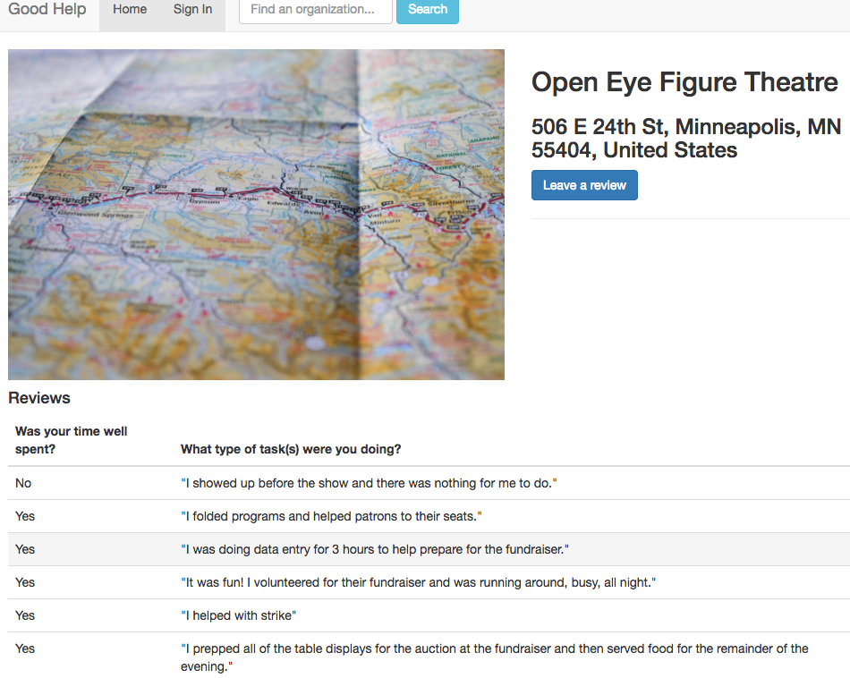

# <a name="top">Solo Project - Good Help</a>
Built for my solo project [@PrimeAcademy](https://github.com/PrimeAcademy), ‘Good Help’ is a dual-rating system application that allows a user to search for
an organization that relies on volunteers and rate their experience volunteering
for that organization. Conversely, an organization can rate volunteers. For ease of use, sign in using an existing Gmail account.

This project was designed to showcase my full-stack skills in planning, designing, and building an application. Technologies: JavaScript, MongoDB, mongoosejs, Expressjs, AngularJS, Nodejs, Bootstrap, Google Places API, Google OAuth, passportjs

## Set-up
1. After forking this repo, open 3 terminal windows: 2 for MongoDB and 1 for Node
2. Run npm install in 1st terminal window
3. Run mongod in 2nd terminal window
4. Run mongo in 3rd terminal; this is the MongoDB
5. In MongoDB, run the following commands:
    - `use goodHelp`
    - `db.createCollection("business")`
6. Navigate back to 1st terminal window and run npm start
7. Open a browser to localhost:3000

## <a name="features">Features</a>
[Homepage](#homepage) | [Search](#search) | [Search Results](#results) | [Review Modal](#review) | [Profile Page](#profile)

### <a name="homepage">Good Help Homepage</a>

#### [Features](#features)
---

### <a name="search">Good Help Search</a>

#### [Previous](#homepage) | [Features](#features)
---

### <a name="results">Good Help Search Results</a>

#### [Previous](#search) | [Features](#features)
---

### <a name="review">Good Help Review Modal</a>

#### [Previous](#results) | [Features](#features)
---

### <a name="profile">Good Help Profile Page</a>

#### [Previous](#review) | [Features](#features)

# Author
- Laura Abend

Back to [top](#top)
