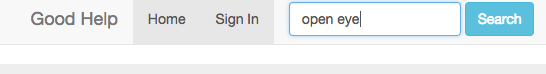
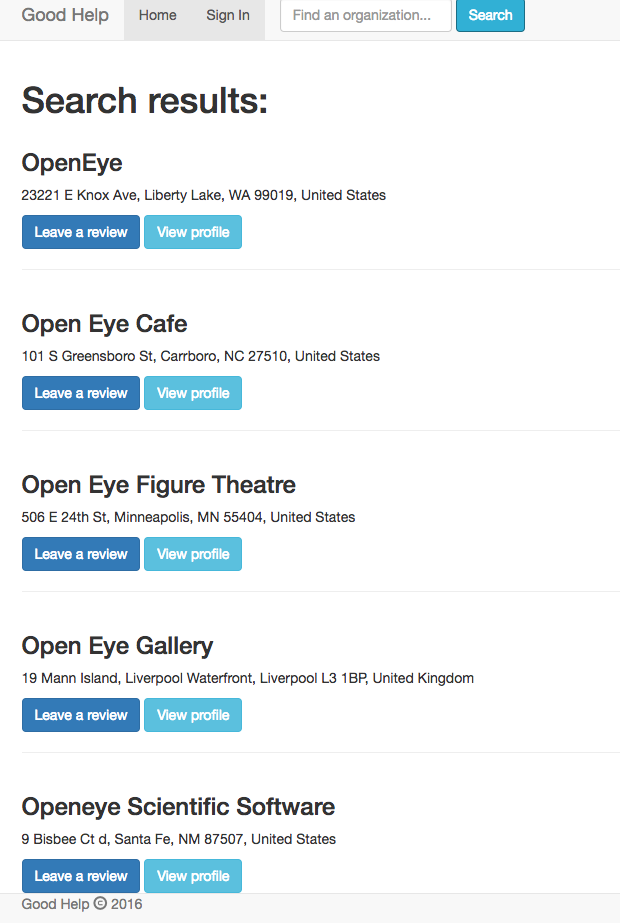
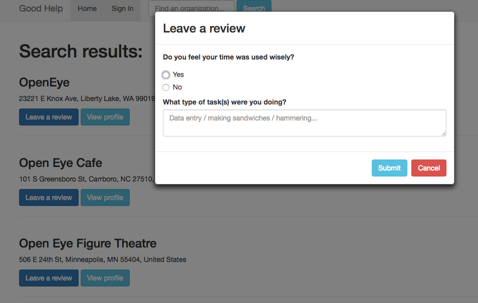

# Solo Project - Good Help
<a name="top">top</a>
Built for my solo project [@PrimeAcademy](https://github.com/PrimeAcademy), ‘Good Help’ is a dual-rating system application that allows a user to search for
an organization that relies on volunteers and rate their experience volunteering
for that organization. Conversely, an organization can rate volunteers. For ease of use, sign in using an existing Gmail account.

This project was designed to showcase my full-stack skills in planning, designing, and building an application. Technologies: JavaScript, MongoDB, mongoosejs, Expressjs, AngularJS, Nodejs, Bootstrap, Google Places API, Google OAuth, passportjs

## Set-up
1. After forking this repo, run npm install
2. In MongoDB, run the following commands:
    - `use goodHelp`
    - `db.createCollection("business")`

## <a name="features">Features</a>
[Homepage](#homepage) | [Search](#search) | [Search Results](#results) | [Review Modal](#review)

### <a name="homepage">Good Help Homepage</a>

Back to [Features](#features)

### <a name="search">Good Help Search</a>

[Previous](#homepage) | Back to [Features](#features)

### <a name="results">Good Help Search Results</a>

[Previous](#search) | Back to [Features](#features)

### <a name="review">Good Help Review Modal</a>

[Previous](#results) | Back to [Features](#features)

# Author
- Laura Abend
Back to [top](#top)
