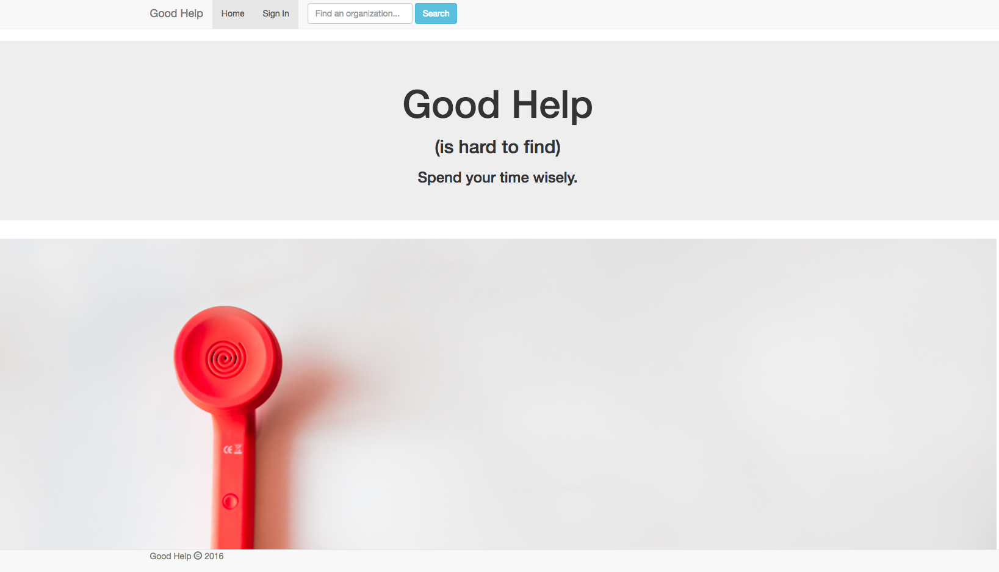

# Solo Project
Built for my solo project @PrimeAcademy, ‘Good Help’ is a dual-rating system application that allows a user to search for
an organization that relies on volunteers and rate their experience volunteering
for that organization. Conversely, an organization can rate volunteers.

## Set-up
1. After forking this repo, run npm install
2. In MongoDB, run the following commands:
    - `use goodHelp`
    - `db.createCollection("business")`

# Author
- Laura Abend
